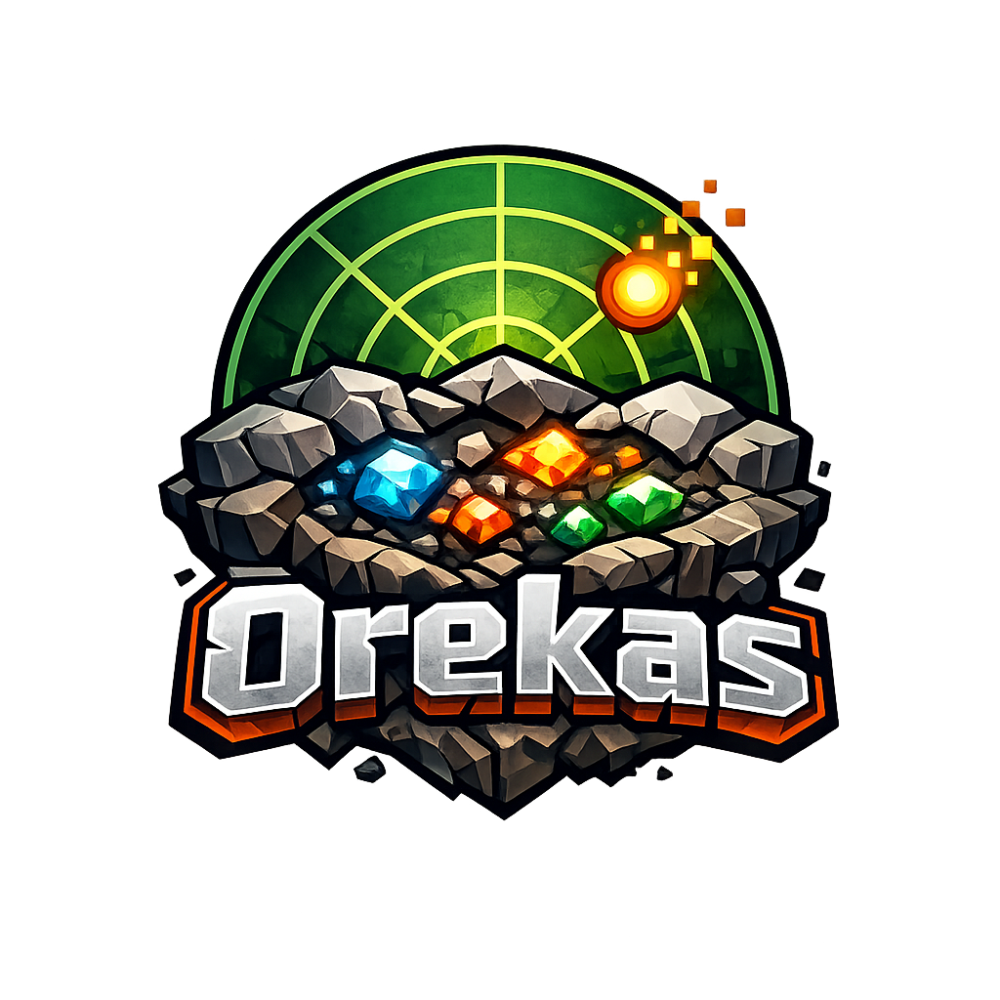

# Orekas

**Ore-vein ESP for [Meteor Client](https://meteorclient.com/), powered by [orefinder.gg](https://www.orefinder.gg)'s WASM model with live-world validation and an anti-xray fallback heuristic.**

## Features

| Module | Description |
| --- | --- |
| **OreFinder** | ESP that highlights every ore block inside a 13×13 chunk window around you. Vein centroids come from orefinder.gg's in-process WASM model and each centroid is validated against the live `ClientWorld` so only real, exposed ore blocks render. Buried clusters on AntiXray-style servers fall back to a centroid prediction box. |

## How is Orekas different from meteor-rejects' OreSim?

[OreSim](https://github.com/AntiCope/meteor-rejects) and Orekas solve a similar problem in different ways:

- **OreSim** simulates Minecraft's vanilla world generation on-device using the world seed. On unmodified vanilla worlds it produces exact ore positions without any third-party model — you get a full client-side chunk generator running in parallel with the game.
- **Orekas** delegates to orefinder.gg's pre-trained WASM model (bundled and shaded — no network calls). The model returns vein **centroids** plus confidence tiers, which Orekas then validates by scanning live blocks in the loaded `ClientWorld`.
- **Per-block validation.** ESP boxes only draw on real ore blocks the client can see. Buried clusters on AntiXray-style servers (Paper engine-mode-2 and similar) get a centroid prediction overlay using the same opaque-neighbors heuristic the server uses to decide what to hide.
- **Practical takeaway.** OreSim is more precise on vanilla worlds and self-contained. Orekas is robust to anti-xray obfuscation and skips running a full chunk generator client-side; the trade-off is that vein positions come from a model rather than a deterministic simulation.

## Installation

1. Install [Fabric Loader](https://fabricmc.net/use/) for Minecraft 1.21.11.
2. Install [Meteor Client](https://meteorclient.com/) for the same version.
3. Download the latest `orekas-addon-<version>.jar` from [Releases](https://github.com/furkankoykiran/Orekas/releases).
4. Drop the jar into your `mods/` folder alongside Meteor Client.
5. Launch Minecraft and look for **Orekas → OreFinder** in the Meteor module list.

## Usage

Toggle **OreFinder** under the Orekas category. Settings are grouped:

| Group | Setting | Description |
| --- | --- | --- |
| Input | `world-seed` | World seed (required on multiplayer; auto-detected on single-player). |
| Input | `platform` | Minecraft edition + version selector (default: Java 1.21). |
| Input | `refresh-now` | Toggle ON to trigger an immediate search. |
| Ores | `diamond` … `coal` | Per-ore inclusion flags. Diamond is on by default. |
| Render | `shape-mode` | Outline / filled / both. |
| Render | `fill-alpha` | Alpha for the box fill (0–255). |
| Render | `nametag-for-unloaded` | Show a `Nx Ore` floating label for clusters whose chunks aren't loaded yet. |
| Render | `nametag-scale` | Size of the floating labels. |
| Colors | `<ore>-color` | Per-ore-type render color. |

## Dimension support

| Dimension | Behaviour |
| --- | --- |
| Overworld, **Y &lt; 0** | Active. Anti-xray heuristic targets the deepslate region servers commonly hide. |
| Overworld, Y ≥ 0 | Idle. Above Y=0 the server typically streams real blocks, so the heuristic is invalid. |
| Nether | Active. Includes Ancient Debris when enabled. |
| End | Idle. The module never renders anything in the End. |

Ancient Debris is filtered out automatically in the Overworld even if the toggle is on.

## FAQ

**Does it work on AntiXray-style servers?** Yes — buried centroids are rendered as prediction boxes when the WASM thinks an ore is fully surrounded by opaque blocks (mirroring Paper engine-mode-2 logic). Per-block ESP still draws the exposed parts of any cluster the server actually streams.

**Do I need the world seed on multiplayer?** Yes. On servers the client never receives the seed, so `world-seed` must be set manually. Single-player is auto-detected.

**Does it phone home?** No. The orefinder.gg model runs in-process via the bundled [Chicory](https://github.com/dylibso/chicory) WASM runtime. There are no network calls at runtime.

**Is it bannable?** Ore ESP of any kind is detectable by anti-cheat systems and against the rules on most public servers. Use it only on servers that explicitly allow client-side modifications, in single-player, or for educational use.

## Credits

- [orefinder.gg](https://www.orefinder.gg) for the underlying WASM model.
- [Meteor Development](https://github.com/MeteorDevelopment) for Meteor Client.
- [Chicory](https://github.com/dylibso/chicory) for the pure-Java WASM runtime.
- Built by **Webrekas**.

## License

[GPL-3.0-only](LICENSE).

## Disclaimer

Orekas is provided for educational and authorized use. Many servers' rules and anti-cheat systems prohibit ore ESP. Respect server rules, and don't use this on servers that don't permit client-side modifications.
